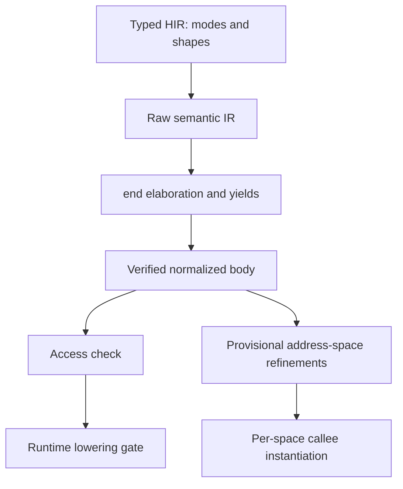

# Access checker architecture

Fe has mutable value semantics: references are not values. A `ref` or `mut`
access exists only as a parameter mode, a named binding (`let h = mut p.x`),
or the result of a projection (a function returning `ref T`, `mut T`, or a
shape such as `(usize, mut T)` or `Option<mut T>`). The access checker
([`semantic/access`](../../crates/hir/src/analysis/semantic/access)) enforces
one rule over each semantic instance's normalized body: two open accesses to
overlapping places conflict unless both read. It also checks moves and
initialization.

Three principles keep it small and predictable:

- **Signatures are the call contract.** A call is checked against the
  callee's signature: its data arguments and the footprints of its declared
  effects. No callee body is summarized.
- **Extents are explicit.** Lowering places an `end` after the last use of
  every access, before any folding, so acceptance never depends on
  optimization.
- **Raw memory is a trust boundary.** Raw pointers and raw storage operations
  require `unsafe` and are not modeled.

## Pipeline

- The type checker sees plain types: a parameter carries a mode, a binding an
  access kind, a projection's return a shape. Semantic lowering represents an
  access by a *carrier* value (`View`, `BorrowRef`, `BorrowMut` types that
  exist only in the IR).
- A projection's every yield site is a `Yield` terminator whose resume block
  runs the slide and returns. A tail or `return` yield has an empty slide; a
  `yield` statement's slide is the code after it. Each yield site yields on
  its own path.
- `end` elaboration (`lower/elaborate.rs`) computes liveness on the raw body.
  An access (a borrow or a projection call's session) stays open while its
  carrier or any carrier derived from it may be used. It ends right after its
  last use on each path; an access that dies on a control-flow edge ends at
  the start of the successor, on an edge block of its own when the successor
  has other predecessors. Accesses ending at one point end innermost first.
- `check_semantic_accesses` checks one instance. The runtime lowering gate
  requires it for every concrete instance, and the diagnostics pass checks
  each item's identity instance and, transitively, its concrete callees.

## Calls and receivers

For a call `r.m(args)` the elaboration order is fixed: the receiver's root
place is resolved first (a temporary is hoisted into a local), the arguments
are evaluated, the receiver chain's projection sessions open innermost first,
and the receiver's access opens last. A `mut` receiver's place is guarded by a
`ref` access while the arguments run, so they may read the receiver but
neither write nor move it. A `Copy` view argument is passed by copy and opens
no access.

## Tokens and places

The analysis resolves carriers to *tokens*:

| Token | Created by | Meaning |
| --- | --- | --- |
| Input | `ref`/`mut` parameters | The caller's place, open for the whole body. |
| Access | borrows and views | A named or call-duration access of resolved places. |
| Reservation | projection calls | A session reserves each argument carrier and each effect domain it is given. |
| Grant | projection calls | One per access component the session yields, derived from the session's reservations. |
| Handle | provider handles | Names a domain; confers no exclusivity. |

An abstract place is a base and a path (fields, variant fields, constant or
dynamic indices):

- `Root`: storage the body owns: locals, owned parameters, temporaries.
- `Param(i)`: the place data parameter `i` names. Its address space is part of
  the instance (`EffectProviderSubst::param_spaces`), refined per call site.
- `Domain(d)`: a resource domain: a contract field, an effect parameter, a
  root provider, or a dynamic domain for a handle of unknown provenance.
  Distinct contract fields are disjoint; other domains of one address space
  may alias, since a caller may supply overlapping providers.
- `Grant { session, component }`: what a session granted. Places derived from
  one grant overlap; sibling components of a split are disjoint.
- `State(space)`: every slot of an address space, the footprint of external
  execution and raw storage authority.
- `Raw`: memory reached through a raw pointer; never checked.

An access through a carrier is authorized by the tokens it was derived from,
so a nested access (`let g = mut h.x`) does not conflict with `h`, and `h` is
usable again once `g` ends. A write through a `ref` access is rejected.

## Interference

Each operation is checked against the open tokens it is not derived from:

- Place reads, writes, moves, borrows and views access their resolved places.
- A call accesses each carrier argument for its duration with the parameter's
  mode, and each declared effect's footprint: the supplied place or handle's
  domain, or all persistent and transient state for a capability that can
  start external executions (`Call`, `Create`, `Evm`) or addresses slots
  directly (`RawStorage`). Immutable authority only reads.
- Calls that start external executions themselves (call intrinsics and
  methods of the reentrant std capabilities) access all state.

So `let v = mut store.value` held across a call whose effects permit
reentrancy is rejected, while closing the access before the call is accepted.
A callee's data parameters must be compatible with its own effects: passing a
storage place as `mut` to a function declaring `mut Call` is rejected.

## Projections

A projection call opens a session: reservations for its arguments and its
`uses` domains, and grants for the yielded components. Sessions are not a
stack; they end at their `end`, in any order. In the projection's body, each
component of every yield site must name places in one address space per
instantiation, and the `mut` components of a split must be structurally
disjoint. Every path that completes yields exactly once. A `mut` yield of a
place in the projection's own frame with no slide after it is a warning: its
writes are discarded.

At runtime every projection call is inlined into its caller
(`mir/src/runtime/lower/inline.rs`): the ramp replaces the call, each `end`
of the session runs its own copy of the slide, and a projection with several
yield sites records which one its ramp took. A projection's grant has the
runtime class its body yields. Recursion through projection calls cannot be
inlined and is rejected by the checker.

## Moves and initialization

A forward analysis tracks possibly moved paths of values, local roots and
`mut` parameters, joined at control-flow merges. Moving out of a place reached
through an access is rejected, except out of a `mut` parameter, which must be
reinitialized before the function returns or yields.

## Constant evaluation

CTFE evaluates a projection call as a session: the callee frame runs until its
`Yield`, stays suspended while the caller uses the grant, and runs its slide
when the caller reaches the session's `end`.
