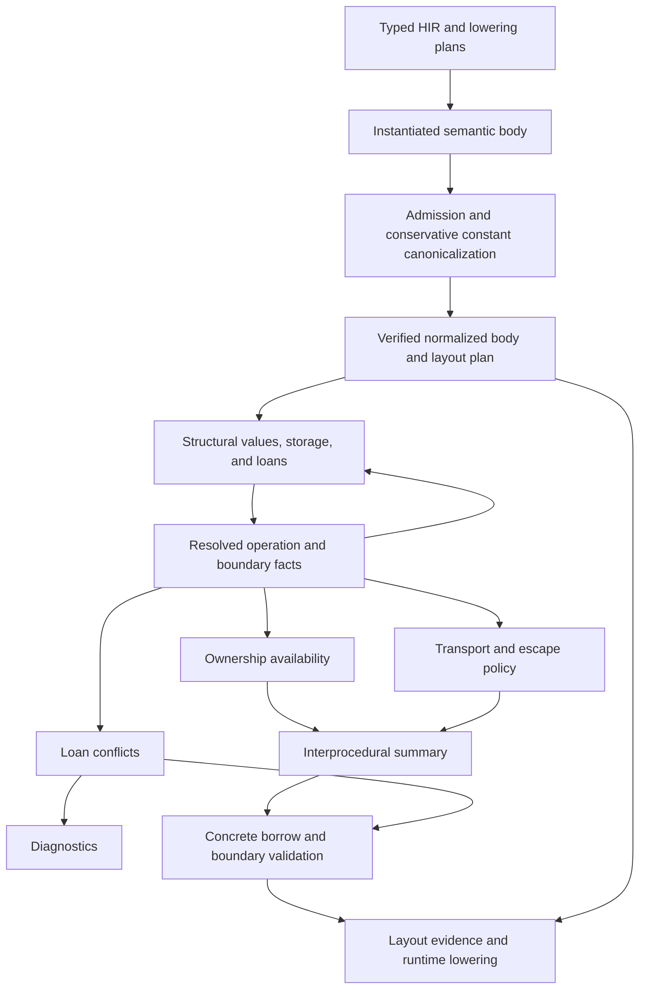

# Borrow checker architecture

Fe's borrow checker analyzes ownership availability, loan conflicts, capability
provenance, and transport and escape boundaries over verified normalized semantic
IR. Runtime layout is a separate consumer of that IR. A scalar-only non-Copy value
has ownership state even when its capability shape is empty.
For source examples and compatibility changes, see
[source diagnostics and compatibility](#source-diagnostics-and-compatibility).

## Admission and consumers



Admission distinguishes an upstream-blocked body from an internal normalization
failure. The shared types and diagnostic constructors live in
[`semantic/diagnostics.rs`](../../crates/hir/src/analysis/semantic/diagnostics.rs),
below the borrow checker. `SemanticDiagnostic` is also used by admission and layout
consumers; normalization does not depend on borrow-checker-owned error types.

Provisional queries supply facts needed to finish provider bindings and admission.
Final queries enforce the resulting ownership and boundary contracts. A blocked
query retains its blocking causes even if it has a conservative signature summary.
A successful summary with `may_return = false` describes divergence; neither a
blocked body nor an internal failure becomes a successful diverging body.

A successful summary describes effects and boundary requirements; local loan
conflicts have a separate validation query. `check_semantic_borrows` checks the
body and its resolved callees transitively, while `check_semantic_boundaries`
consumes the summary's boundary result. The
[runtime instance lowering gate](../../crates/mir/src/instance/runtime.rs)
requires both checks to succeed for each concrete semantic body before lowering
it. A pending, blocked, or failed result cannot pass that gate.

Admission-time CTFE runs before these summaries exist. Its conservative raw-body
invalidation remains independent. Contract-field definite assignment similarly
has a distinct initialization contract; it does not replace general ownership
availability for pointer referents.

## One operation contract

[`normalized/access.rs`](../../crates/hir/src/analysis/semantic/normalized/access.rs)
exhaustively describes statement accesses, terminator operands, and successor
arguments. It reuses `MemoryAccessKind`. Structural paths select the accessed
portion of an SSA value. Place accesses also require their carrier and index
operands, including when the operation is a store.

| Operation | Availability | Conflict access | Ownership transfer |
| --- | --- | --- | --- |
| Read | Selected contents are available | Shared | None |
| Move | Selected contents are available | Exclusive | Consume selected portion |
| MakeView | Source is available | Shared | None |
| Native borrow | Source is available | Shared, mutable, or reserved | None |
| Typed store | Source and destination address are usable; parent is available | Exclusive destination | Restore only a certified destination |
| Call | Arguments and callee entry requirements | Callee access history | Callee normal-return transformer |

Native capability carriers are not ownership-consuming copies. A projected move
selects its field rather than consuming the entire aggregate. A reserved mutable
receiver retains `BorrowActivation::AtCall`, so receiver reservation does not
prematurely conflict with nested argument evaluation.

Liveness, conflict checking, availability, and summary access collection consume
this contract. Each analysis applies its own transfer rule rather than inferring
semantics from a generic operand visitor.

Availability uses one evaluator for fixed-point propagation and diagnostic/summary
replay. Accesses explicitly identify address evaluation, operands, and writes;
their position in the flat vector is not an execution order. Carrier and index
reads see the incoming state. The consuming operand batch rejects overlapping
guarded ownership regions, including two uses of one SSA owner, before checking
callee entry requirements. Definite writes, normal-return effects, and the fresh
result holder are initialized afterward. Disjoint fields and mutually exclusive
guarded alternatives remain separate. Zero-sized non-Copy owners still cannot be
consumed twice, even though their physical accesses touch no bytes.

## Physical access footprints

[`capability/footprint.rs`](../../crates/hir/src/analysis/semantic/capability/footprint.rs)
combines a guarded region with a typed extent, a byte length, or an unknown extent.
Address identity, physical overlap, definite typed coverage, and valid native
contents are separate proofs. Different starting addresses do not imply disjoint
accesses, and full byte coverage does not establish native authority.

For linear memory, the semantic `size_of` representation contract supplies typed
widths and field/element offsets. Known nonwrapping intervals can prove separation;
unknown types, lengths, offsets, unsupported views, and overflowing arithmetic
retain possible overlap. Capability-leaf counts and runtime backing homes provide
no size evidence. Casts retain address identity while changing the accessed type,
including casts from zero-sized pointees. Other address spaces retain their object
semantics rather than using linear-memory byte arithmetic.

Intrinsic contracts distinguish byte and word operations and describe both sides
of copies, zeroing, hashing/logging, return/revert data, creation code, and external
call buffers. Zero-length byte accesses are empty; unknown lengths are not zero.
Byte writes remain may-writes and never certify typed initialization. Extents are
part of summary equality and survive scalar substitution, forwarding, and clobber
conditions. Corruption is discarded only after the full write footprint is proven
disjoint from the affected typed cell.

## Structural values and stable resolution

Capability values describe product fields, enum alternatives, and symbolic array
families. Their leaves distinguish raw addresses, views, native loans, and native
contents invalidated by byte writes. Regions combine typed storage roots,
structural projections, guards, and bound indices. An SSA holder is a logical
ownership location, not addressable storage.

The solver closes storage discovery and loan relations together. Resolving a call,
following a held capability, or resolving a boundary requirement can discover
another typed storage cell. Discovery triggers replay before snapshots and resolved
operations are published. Availability, conflict checks, and summary construction
then read those completed facts. Summary construction cannot extend storage.

Local identities come from normalized operations, values, and structural leaves.
Array and loop occurrences carry explicit indices or lexical witnesses. Export
renames occurrences to summary identities; call substitution maps them to the
call site. Replaying an analysis does not allocate a new opaque identity.

### Typed storage families and discovery epochs

External typed cells retain their original source, including address-space
contract, projections, dereference boundaries, reachability, and clobber
dependencies. Matching aligns indices by those structural roles. An omitted
element offset denotes zero; a symbolic offset matches it only under a proved
zero guard. Repeated family parameters retain their equality constraints.
Clobber-only indices are bound for read substitution without becoming physical
cell selectors. A checked match supplies a read substitution and guard; a
separate write embedding is available only where a definite family update can
be represented. A widened reachable source can be read conservatively but is
not strongly replaced.

Storage coverage is the union of supported typed-cell match guards in the demand's
scope. The solver compares the actual read guard with that union. An incomplete
external demand registers a full symbolic family with its appropriate entry,
fresh, or unknown-byte seed, then replays earlier writes. A restricted read
guard never establishes that an unrestricted family is already inventoried.
Registration must grow canonical declarations; an uncovered demand with no
growth is an internal invariant failure. Missing local storage is not external
discovery.

Typed stores update every represented family on the guard where the selected
member is definitely written. Prior unknown contents remain on the complement.
A possible destination receives a weak update. Physical overlap is checked
separately: a conditional typed match does not suppress invalidation at other
byte offsets, while a typed effect already handled for the same reachable
whole-cell representation does not receive a redundant opaque invalidation.

Discovery restarts the block-state fixed point before snapshots, resolved
operations, boundary requirements, or summaries are published. Stable loan
declarations include entry loans and call poststate loan IDs; inferred regions
and parents are reset to those seeds when the storage inventory grows. This
prevents facts derived from provisional unknown contents from surviving a replay.

## Raw range validity

Allocation disjointness and elision of fresh-allocation effects assume each raw
operation's **whole footprint** fits, without address/length wrapping, inside its
live allocated object. The compiler tracks provenance, not allocation bounds for
arbitrary raw spans. Two 32-byte allocations are disjoint under this premise; a
64-byte access starting at the first allocation violates the raw API contract.
Borrow acceptance of that access is not a static bounds proof.

`alloc_raw`, `alloc`, `alloc_bytes`, `MemArray::new_uninit`, and buffer allocators
establish the requested byte extent. They do not establish typed native contents.
Raw dereferences, `zero_bytes`, `copy_raw`, and `copy` assert valid complete access
ranges; copy requires both ranges and permits overlap. `MemSlice::from_raw_parts`
asserts its complete range without checking it. `cast`, `byte_ptr`, and `offset`
preserve an address interpretation and do not enlarge, validate, or initialize an
allocation. A cast also supplies no native authority.

`MemSlice::try_slice`/`slice`, slice indexing, and array indexing check containment
relative to an already valid parent extent. Buffer reserve and checked buffer
writes establish room for their full byte ranges. A forged parent extent cannot
be repaired merely by taking a checked subrange. Native-reference leaves separately
require valid typed initialization; zeroing or copying bytes cannot provide it.

The `raw_extent_contract.fe` execution fixture pairs a valid complete raw write
with checks that reject ranges crossing the end, including nonwrapping length
checks. `raw_allocation_effect_elision_assumes_the_complete_range_contract` also
records the compile-only, out-of-contract 64-byte candidate: it is deliberately
not executed or described as proved safe. General raw-bounds inference would
require allocation-size and whole-footprint containment evidence in addition to
the provenance tracked here.

## Entry contents, allocation birth, and opaque overwrites

Entry contents mean the caller's contents at function entry. Substituting an entry
source at a call can therefore resolve to a precise old pointer. They cannot model
bytes that an intervening write has replaced.

Storage discovery classifies its seed independently of query order: actual entry
contents remain symbolic caller data; fresh allocations start uninitialized; other
manufactured addresses contain unknown bytes. The latter two use the same
structural arbitrary-contents constructor as byte writes. Native leaves have an
unconditional invalidity marker, with no disjoint-clobber condition that could
restore authority. Pointer/handle leaves contain stable unknown addresses and do
not inherit the containing allocation's freshness. Scalar facts track exact
stores and loads separately; raw scalar bytes do not establish native authority.

Inventory presence is separate from runtime birth. Immutable call birth templates
come from trusted Allocation sources in existing summaries, including results
with capability-free non-Copy pointees. Instantiation preserves occurrence,
allocation choice, family arguments, and guards. Returning an input pointer or
manufacturing an opaque address does not establish a birth. The resolved operation
publishes these same events after provenance/discovery closure.

Recognized allocating constants, currently dynamic string literals, also publish
births using their normalized result occurrence and loop generation. Their
provenance transfer applies the same event before publishing the literal value;
late-discovered typed views participate through the existing inventory replay.
Literal emission initializes raw ABI bytes, which do not construct native loans.
Scalar constants and inline static strings have no allocation event. Copying a
literal-derived pointer preserves its identity; evaluating a separate allocating
literal creates a distinct occurrence.

One shared selector identifies the allocation's own physical bytes, including
casts, offsets, and projections. Following a stored pointer does not select its
referent. Provenance resets selected current members to their byte seeds;
availability keeps each earlier move under its guard minus the birth selector.
Older moved members and unrelated choices remain unavailable. Birth grants neither
a native loan nor a definite initialization fact. Callee source substitutions all
use the pre-call snapshot; byte seeding precedes final structural poststates.
Inventory cells and candidate moved sites are indexed by allocation occurrence,
and the cell index is rebuilt when discovery grows the inventory. Earlier members
retain their contents. A definite valid typed
store establishes native contents, while weak stores retain invalid alternatives.
On late discovery the fixed point replays earlier stores against the correct
seed. Reads and native transport, including discarded loads, use the same native
validity checks; raw pointer transport itself does not assert initialized contents.
Seed identities use normalized allocation/handle occurrences and structural leaves,
with lexical witnesses for families. Following unknown pointer contents reuses
the seed site, so replay cannot grow an unbounded chain of identities.

[`capability/opaque.rs`](../../crates/hir/src/analysis/semantic/capability/opaque.rs)
constructs arbitrary replacement contents from the affected shape. Raw pointer and
nominal handle leaves preserve their declared address-space contracts. Their opaque
addresses can alias existing compatible storage; they are not fresh allocations.
Array leaves have independent lexical witnesses rather than a shared invented
address for every element.

Raw bytes establish no native loan or view authority. Native leaves therefore
become explicit invalidity markers, carried through values, loads, summary export,
and call substitution. Definite corruption rejects typed use. A possible overwrite
through symbolic input aliases produces an explicit native-validity obligation:
the affected storage and write destination must be disjoint. Callers discharge
that obligation using their actual regions or forward it through symbolic inputs.
An unresolved concrete alias rejects. Only the preexisting valid alternatives can
supply native authority; arbitrary replacement bytes never create a loan.

An opaque alternative retains an overlap condition when its addresses are
representable. Call substitution removes it only after proving the affected cell
and write destination disjoint. This preserves fresh-allocation precision across
helpers while retaining corruption for possible aliases. A write through an earlier
arbitrary replacement retains that replacement's corruption prerequisite.
Dropping the additional overlap test widens uncertainty without growing nested
conditions or allowing repeated writes to invent unconditional corruption. A
definite typed store can replace invalid contents with valid native contents again.

Both generic memory invalidation and possibly overlapping typed stores use this
operation. Matching shapes do not prove matching byte alignment: a partial raw
store can corrupt a native slot while copying a valid native value.
An intrinsic byte write invalidates an exact tracked pointer cell too, even when
the intrinsic has no structural poststate. Weak writes retain the old possibility
as well as arbitrary replacement contents.

Abstract storage discovery follows inline fields. A type parameter behind a
pointer or native borrow belongs to separate referent storage and does not make
the containing representation abstract. Clobbering checks each capability leaf's
storage path, so writing a scalar field does not corrupt a disjoint pointer field.
Sealed EVM effect witnesses retain their trusted zero-sized representation and
do not acquire invented hidden fields.

### Structural input transport

The input transport contract uses each parameter's role and interned capability
shape to interpret exact input and followed-source paths. An ordinary parameter's
held mutable native borrow has a Memory referent precondition, including borrows
inside owned, viewed, or borrowed aggregates. Native shared borrows and views
keep their read-only provider policy. Following a raw pointer or nominal handle
ends inherited held transport; receiver and effect arguments retain their
provider-aware write obligations. Array selectors and enum presence remain in
the existing structural value guards.

Entry seeding applies this policy to each input-derived capability. Summary
verification replays the same source path and checks the final referent contract.
At calls, held and effect capability traversal evaluates the same transport mode
against actual guarded regions, forwarding unknown requirements or rejecting an
incompatible provider. The policy constrains entry contents only; a later typed
write replaces their provenance. It never makes a same-Memory pointer distinct
from a mutable Memory borrow.

## Definite writes

`RegionSet::definite_write` provides the shared certificate for strong provenance
updates and ownership restoration. The current criterion requires one non-widened
destination with no additional existential target selection. A runtime index can
denote one cell, but coverage must still prove that this is the moved cell.

A may-target union such as `{A, B}` does not prove that either particular cell was
written. A field write does not restore an entire moved aggregate. At a call,
each guaranteed callee destination is instantiated separately and certified again:
an exact formal pointer may be an ambiguous actual pointer.

The certificate is necessary for a strong structural update, which also checks
interference among simultaneous poststates. Distinct poststate entries do not
encode an execution order.

## Summary composition

`BorrowSummary` contains several independent components:

- The result's structural capability value.
- Caller-visible capability-content poststates.
- Possible memory access history and its authorizers, for loan conflicts.
- Incoming ownership requirements and normal-return availability effects.
- Native-validity obligations for conditional raw overwrites.
- Boundary requirements for transport, retention, and writable storage.
- Whether a normal return is possible.

All components participate in equality and interning. Summary construction runs
the same availability analysis as local diagnostics; correctness does not depend
on a diagnostic query running first. Ownership effects are exported for scalar-only
non-Copy pointees as well as aggregates containing pointers or native borrows.

Signature-only summaries distinguish unknown results from unknown writable
contents. A returning native result includes valid referents and creates a result
loan when instantiated. Raw input candidates supply addresses without becoming
inherited native parents. An arbitrary memory referent also covers permitted fresh
allocation results; it does not claim the stronger identity of a known allocation.
Writable poststates separately join valid possible contents with shape-aware opaque
replacement, including invalidated-native alternatives. They cannot turn a raw
clobber into a guaranteed restoration of entry validity.

A bare callable signature does not bound raw effects to its arguments. Its fallback
includes arbitrary compatible-space reads, writes, and consumption, including for
parameterless calls. Each effect remains an individual `MemoryAccessKind` event;
choosing a maximum kind would lose either contents invalidation or ownership loss.
Compiler-defined intrinsic identities have explicit contracts instead. Numeric
intrinsics are recognized by their core-library identity, not by a user-declared
function's spelling. Unknown semantic addresses carry no runtime layout evidence.

Unresolved implementations produce explicit `Pending` validation, separate from
successful checking and upstream-blocked bodies. The pending result records the
unresolved semantic callee keys and propagates transitively through calls and
recursive query recovery. Conservative summary facts remain available internally
for analysis; they do not constitute a checked executable contract. Public borrow,
boundary, and summary consumers report pending validation as an incomplete result.

Generic templates retain type/normalized-IR checking, checks before an unresolved
call, and the call's operand checks. An unbounded unknown effect makes subsequent
memory-dependent checks conditional along every reachable successor. SSA holders
have no address, so their move checks remain active across statements and control
flow; moving through a borrowed/view carrier also remains forbidden. Concrete
specialization recomputes the body and its callees under the selected implementation
and must finish validation before runtime lowering. Executable calls that remain
opaque are rejected, even when they have no arguments or active borrows.

A trait default body is not an effect contract for an unresolved call: an
implementation may override it. Trusted intrinsic contracts remain usable through
trait dispatch. Compiler-provided contract code offsets and lengths have explicit
contracts only for concrete contract types, using the same library identity check
as runtime lowering.

Trusted external-call contracts include current-context state independently of
buffer arguments. `DELEGATECALL` can read and write any persistent or transient
slot directly. `CALL`, `CREATE`, and `CREATE2` conservatively have the same state
effects through callbacks. `STATICCALL` can read those spaces through callbacks;
its propagated static context forbids state writes. Consequently, shared native
state loans cannot cross unrestricted state interference, and exclusive native
state loans cannot cross either kind of unbounded state access. A constant callee
address or a mutable zero-sized EVM witness does not establish a narrower contract.

`IntrinsicMemoryTarget::WholeSpace` has an uncertain, stable region source with
`AccessExtent::Unknown`. It denotes any compatible slot and supplies no authority
over native child loans. Writes remain possible writes, never proof of typed
initialization. Local checks, opaque contents invalidation, summary forwarding,
recursive composition and specialization consume the same effects. Linear-memory
effects remain the explicit input/output buffer footprints; external execution
does not directly share the caller frame's other memory. Locking fixtures follow
these ordinary rules; the checker has no lock-name exemption.

The state policy follows [EIP-7](https://eips.ethereum.org/EIPS/eip-7),
[EIP-1153](https://eips.ethereum.org/EIPS/eip-1153), and the static-context propagation
in [EIP-214](https://eips.ethereum.org/EIPS/eip-214).

Summary verification rejects a feasible returning native slot with no represented
referent. This is distinct from empty arrays, absent enum alternatives, moved
poststates, and genuinely nonreturning paths, which may contain no native value.
An empty enum result still requires provenance when every variant contains a
required native value, including through nested records and nonempty arrays.

The availability transformer is:

```text
unavailable_after =
    ((unavailable_before minus proved born members)
        minus certified definite reinitialization)
    union possibly unavailable on normal return
```

Arguments and callee incoming requirements are checked before birth. Certified
reinitializations and then callee exit moves follow birth; result-holder
initialization comes last. Thus an allocating helper that consumes its new Item
and returns the pointer leaves that Item unavailable. Nonreturning calls have no
normal-return successor state.

Incoming requirements include accesses that a preceding guaranteed initialization
has not discharged. Read, view, borrow, and move require available contents. A
write requires a usable parent and allows whole replacement of a moved slot.
Write requirements are conjunctive: a later whole write cannot excuse an earlier
partial write through a moved parent.

`move(p); initialize(p)` retains a move in conflict history while leaving `p`
available on return. `initialize(p); move(p)` can accept an unavailable `p` on
entry but leaves it unavailable on return. Sorting access history cannot reproduce
either ordered transfer.

Possible moves join by union. Definite initialization must hold on all feasible
normal-return paths. Disjoint representable guards preserve conditional facts;
overlapping paths require common coverage. The entry edge of a loop prevents its
body from being assumed to execute. Prior-iteration witnesses cannot establish a
definite write for the next iteration. Clause-local existential witnesses that
occur only in scalar guards are projected away before alpha-normalization. This
prevents an unbounded chain of historical generation disequalities without
forgetting the older object named by the region or witnesses indexing enum choices.
Allocation selectors also project scalar traversal witnesses (such as the member
index in an array of repeated pointers) that do not identify a distinct object.
Feedback is identified by DFS cycle-closing edges from the actual entry, rather
than block-number order: an acyclic branch join must preserve the generation in
which its selected pointer was allocated.
Every cyclic region has a repeated-value set, including an empty set when the
verified normalized cycle defines no values. Such cycles still participate in
feedback and no-normal-return analysis.

Boolean branch edges carry complementary guards keyed by the actual normalized
boolean value. Exact SSA forwards retain that identity; boolean block parameters
are related to their incoming values under each predecessor guard. Summary guards
over formal boolean inputs map to the caller's actual value, while internal
choices receive a distinct identity at each call. Repeated values computed in a
loop are forgotten on feedback, so one iteration's choice cannot certify another.
This preserves the allocation alternative selected by a boolean through a join
without reviving a previously moved pointer or turning one-path native
initialization into an unconditional fact. Trusted primitive comparisons add
same-type integer equality and unsigned ordering to those guards when their
operands feed a tracked selector or representable return. Negation,
conjunction, and disjunction carry bounded relations; user methods with similar
names do not. Exact scalar cells remember guarded store versions, and a load
binds a new SSA value only while no possible write has invalidated that cell.
Unsigned widening and same-width same-signedness casts share index identity;
truncation and signed widening do not. Indexed selectors and supported return
relations seed scalar demand; unsupported return-only phis stay opaque, and
ordinary loop feedback omits unsigned bounds until a loop proof can justify
them. Integer block parameters retain guarded incoming equalities, and
normal-return summaries can export scalar result
relations and definite constant values for writable scalar inputs. Local scalar
choices are projected before summary export, while public boolean choices map
to the caller's actual arguments. Possible input aliases and memory effects from
calls in a recursive component project
their internal call choices; distinct nonrecursive calls keep independent choices.
Hidden index witnesses are projected in one shared decision-graph traversal.
Injective, order-preserving decision renames reuse the existing branch order;
renames that reorder or identify decisions use Shannon expansion.

### Certified loop contents

A separate loop proof recognizes a narrow unsigned `i < count` fill loop with a
zero entry value, a unit increment, one definite typed store to the indexed
family, and one normal exit. It checks the normalized control flow and every
write, move, availability update, allocation birth, and call effect that could
change the frontier or earlier members. A certificate then records a must
coverage guard for `member < count` and a pointer-content template from the
store, after forgetting facts that depend on the current iteration. A store
to the same concrete cell on every iteration has a separate last-write proof;
its coverage is only `member == 0 && 0 < count`.

Certified coverage is separate from possible contents, allocation births, and
native authority. The checked typed-cell match applies the content template
only to covered members; zero iterations, skipped stores, changed selectors,
clobbers, and overlapping writes cannot create a larger guarantee. Feedback,
births, and subsequent writes invalidate affected certificates. Availability
uses certified initialized members for reads without treating the entire fresh
allocation as initialized. Normal-return summaries export a range only when
all returning paths establish it, and calls instantiate its destination,
coverage, and contents against the same pre-call state. Reader loops may use
their unsigned bound only after a corresponding fill certificate is established.

The joint solver checks its complete incoming states after each sweep so a
temporary join/widen change within a sweep does not prevent convergence.
Recursive pointer forwarding converges, but recursively returning newly
allocated pointers can grow summary allocation choices and reach the existing
bounded convergence diagnostic. Nonconvergence never grants validation through
an opaque fallback.

The must-initialization set contains caller-visible external storage whose type
can become moved or contain native validity obligations. Local moved facts still
receive every definite write. SSA definitions, fresh allocations, and
capability-free Copy storage do not accumulate in the summary set; byte writes
cannot reinitialize differently typed moved aggregates. This avoids constructing
unrelated offset-coverage conditions in wide encoders.

Recursive summaries start with no known normal return. Base cases establish
normal-return facts, and subsequent iterations compose them. Private opaque
addresses used only in availability effects are quantified within their clauses,
which avoids growing call-depth identities or accidentally relating independent
effects. Such private identities do not establish definite initialization in callers.
Opaque signature contracts conservatively consume exposed non-Copy raw pointees
and supply no restoration guarantee. Trusted byte-memory intrinsics describe byte
accesses; a byte write is not an ownership-consuming load.

Every call resolves its result sources, requirements, and effects against one
pre-call snapshot. Provenance poststates are then applied simultaneously. A callee
body still observes its own statement order. Aliasing between formal destinations
can make an additional forwarding summary less precise than inline execution;
sound overapproximation is required, universal acceptance equivalence is not.

## Frontend and runtime integration

Trait selection preserves implementation evidence and associated-constant
binders through selection and substitution. Those semantics support correct
instantiated bodies but are not part of the ownership dataflow or its abstract
domain.

Runtime lowering consumes the normalized body and its explicit layout plan,
including terminal capability stores through referents, materialized views,
parameter carriers, and synthetic values with independent runtime homes. These
are implemented in
[`mir/runtime/lower/semantic_body.rs`](../../crates/mir/src/runtime/lower/semantic_body.rs),
the runtime return/argument adapters, and codegen, with handle-preservation tests
covering their interaction. Layout cannot supply ownership facts missing from
normalized semantics.

Frontend move marking recognizes dereferences of temporary pointers, including
selected fields and array elements. Lowering preserves those places through
normalization; projecting a read snapshot must not replace consuming the original
storage. Copy values remain non-consuming.

Place typing preserves native-reference slot types: for `slot: *ref u256`,
`*slot = value` replaces the stored reference and requires a reference value.
Compound assignment instead accesses the referent, so `*slot += 1` requires
`slot: *mut u256`. Contextual Copy reads, including reads from native-reference
call results, become explicit referent loads in normalized IR. The frontend also
rejects mutable method borrows of fields through an immutable `own self` binding.
These distinctions are covered by the
[type-check tests](../../crates/hir/tests/ty_check.rs) and
[normalization tests](../../crates/hir/src/analysis/semantic/normalized/normalize.rs).

## Stored native references and static runtime views

Runtime lowering keeps ordinary compiler views in their static `Const`, `Object`,
or `Provider` representation. Local native borrows and specialized parameters can
also retain a known transport. Native `ref`/`mut` fields and raw-pointer slots use
`RefKind::Native`: a one-word handle to an immutable address/layout descriptor.
The descriptor distinguishes packed Fe memory, native Sonatina object memory,
and storage, transient, calldata, and code address spaces. Exporting an object
uses its original allocation, preserving aliases; converting a stored native
carrier back to a static view by copying its referent is forbidden.

Immutable constant views have no mutable allocation identity. Converting one to a
stored native reference realizes its scalar or aggregate value in addressable
storage; existing object references always export their original allocation.

Aggregate construction converts native fields explicitly with `RExpr::NativeRef`.
Joins of native references with different physical layouts use that same carrier,
and function declarations and body inference share the transport-join rule.
Loading a reference from a slot returns the stored carrier, not the slot address.
Return inference and value forwarding retain normalized operands: a loaded native
field remains its descriptor even when its semantic local is an erased place alias.
Copy scalar parameters materialize their value when the calling convention carries
an implicit view. Declaration and body queries enforce the same return class.
The verifier checks these conversions independently of semantic borrow checking;
runtime representation never supplies ownership or aliasing authority.

Copy reads of native call results bind the callee's declared reference carrier
before explicitly loading its referent. Slot assignment similarly uses the
destination's class to distinguish replacing a carrier from writing its referent.

Native scalar fields occupy words, and native enum payloads concatenate variants.
Raw memory, calldata and code use packed fields and overlaid enum payloads; storage
and transient storage use word slots and overlaid payloads. Descriptor projection
and dereference preserve these distinctions across calls and control flow. Creating
a descriptor costs a two-word heap allocation before optimization; copying an
existing native reference copies only its one-word handle. User buffers must reserve
their complete extent before writes, including across compiler-generated allocations.

The [native_reference_runtime tests](../../crates/fe/tests/native_reference_runtime.rs)
cover storage, transient storage, calldata, and code descriptors, readonly rejection
at concrete specialization, live references across callee allocation, and
query/declaration order. The O2 cost test in that integration-test harness compares
two non-inlined helpers selecting one of two `u8` values with helpers storing and
returning native references to those same values. Both branch results are checked
by execution.

| Representation in this fixture | Deploy bytes | Runtime bytes | First branch gas | Second branch gas |
| --- | ---: | ---: | ---: | ---: |
| Static view | 194 | 175 | 22,120 | 22,090 |
| Stored native carriers | 403 | 383 | 22,259 | 22,228 |

Gas includes transaction and calldata costs. This fixture measures 209 extra deploy
bytes, 208 extra runtime bytes, and 138–139 extra call gas for native carriers;
descriptor construction and dispatch are not fully optimized away. These are
comparison programs under this harness's compilation settings, not a historical
branch-wide estimate. The
[checked-in cost snapshot](../../crates/fe/tests/native_reference_runtime_cost.snap)
records the baseline for future changes under the same harness.

## Source diagnostics and compatibility

The UI fixtures below preserve complete diagnostics, including source labels, for
these rules and current precision limits. Each fixture contains both the rejected
case and accepted alternatives, labeled in the source. A precision-limit snapshot
records current behavior; it should change when a sound improvement makes the
program acceptable.

| Source pattern | Current behavior | Diagnostic fixture |
| --- | --- | --- |
| Read `items[index]` after moving `items[0]`, even after `assert!(index == 1)` | The assertion does not supply an index-separation proof. A literal disjoint index is accepted. | [Asserted index separation](../../crates/uitest/fixtures/semantic_borrowck/asserted_index_separation.fe) |
| Zero or byte-copy a native-reference slot, then load it | Raw bytes do not establish a valid native reference. Typed reference stores and copies are accepted. | [Native slot initialization](../../crates/uitest/fixtures/semantic_borrowck/native_slot_initialization.fe) |
| Move one cell, then write through a pointer selecting that cell or another | The write cannot definitely restore the moved cell. An exact destination is accepted. | [Ambiguous reinitialization](../../crates/uitest/fixtures/semantic_borrowck/ambiguous_reinitialization.fe) |
| Keep a storage borrow live across an external call | CALL conflicts with shared and mutable state loans; STATICCALL conflicts with mutable state loans. Ending the loan before the call and reborrowing afterward is accepted. | [External call state borrows](../../crates/uitest/fixtures/semantic_borrowck/external_call_state_borrows.fe) |
| Select an allocating factory with a boolean inside a loop, then consume the joined result | Complementary branch guards preserve the selected fresh allocation and accept the move. Moving it twice still conflicts. | [Boolean factory loop](../../crates/uitest/fixtures/semantic_borrowck/boolean_factory_loop.fe) |
| Recursively return freshly allocated objects | Summary allocation choices can fail bounded convergence. Recursively forwarding an existing pointer is accepted. | [Recursive fresh return](../../crates/uitest/fixtures/semantic_borrowck/recursive_fresh_return.fe) |
| Use a raw pointee after an unresolved generic operation | Template validation remains pending. A concrete implementation that consumes the pointee makes the subsequent use invalid. | [Generic ownership specialization](../../crates/uitest/fixtures/semantic_borrowck/generic_ownership_specialization.fe) |
| Execute a bodyless, untrusted function | The call remains pending even without arguments; its signature supplies no effect bound. | [Opaque executable call](../../crates/uitest/fixtures/semantic_borrowck/opaque_executable_call.fe) |
| Leave a function-local reference in a fresh raw heap slot when returning | The retained-storage boundary rejects the local borrow even when only a copied integer is returned. A heap-owned referent has a different lifetime and is accepted. | [Retained local reference](../../crates/uitest/fixtures/semantic_borrowck/retained_local_reference.fe) |
| Return a mutable borrow inside a tuple and create an overlapping live borrow | Destructuring the tuple preserves the loan. The overlapping borrow is rejected, just as with a direct return. Ending the first loan before reborrowing is accepted. | [Returned tuple borrow](../../crates/uitest/fixtures/semantic_borrowck/returned_tuple_borrow.fe) |

A fresh raw heap slot is not a function-local ownership container merely because
its pointer is not explicitly returned. Leaving a borrow in that storage is a
separate export from the function's return value. Returning a copied scalar does
not erase the slot's retained reference. Native slots must satisfy both typed
initialization and the retained-storage boundary.

Raw allocation bounds and native-reference representation costs have different
coverage because they do not necessarily produce diagnostics. The
[raw range validity](#raw-range-validity) section documents the caller's complete
range obligation and its compile-only out-of-contract example. The
[stored native reference](#stored-native-references-and-static-runtime-views)
section records the runtime representation and measured comparison costs.

## Verification and conservative limits

The semantic borrow suite pairs unsafe inline programs with helper and forwarding
forms. It covers implicit views, shared-loan moves, consumed scalar-only pointees,
opaque writes, typed restoration, ambiguous destinations, CFG joins, recursion,
and summary queries made before diagnostics. Bounded two- and three-cell models
compare joins, summary composition, and write guarantees with concrete executions.

Unknown raw addresses may alias moved local representation storage. Likewise,
simultaneous poststates and existential destinations can retain extra alternatives.
These cases can reject programs that a stronger relational analysis would accept.
They must never turn a possible write into definite initialization or grant native
authority to arbitrary bytes.

Use `cargo nextest r --release --workspace --all-features --locked --no-fail-fast`
for the complete suite, together with
`cargo +nightly fmt --all -- --check` and workspace Clippy. Admission, CTFE, layout,
runtime, and codegen tests are required as well as the focused borrow regressions.
