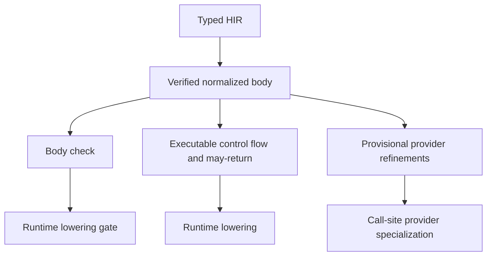

# Borrow checker architecture

Fe's borrow checker enforces ownership (moves and initialization) and the
aliasing rules of `ref`, `mut`, and view borrows. It runs on each semantic
instance's verified, operation-preserving normalized body
([`semantic/borrow`](../../crates/hir/src/analysis/semantic/borrow)).

Three principles keep it small and predictable:

- **Signatures are the call contract.** A call is checked against the
  callee's signature only. No callee body is summarized, so a change to a
  function's body never changes whether its callers are accepted.
- **Raw memory is a trust boundary.** Dereferencing a raw pointer and calling
  raw-memory operations require `unsafe`. The checker does not model raw
  memory; accesses through raw pointers are unchecked.
- **Places, not values.** Fields and constant indices are disjoint; a dynamic
  index may denote any element. Branch conditions and integer values are not
  tracked.

## Admission and consumers


```mermaid
flowchart TD
    Typed[Typed HIR] --> Normalized[Verified normalized body]
    Normalized --> Check[Body check]
    Normalized --> Control[Executable control flow and may-return]
    Normalized --> Refine[Provisional provider refinements]
    Check --> Gate[Runtime lowering gate]
    Control --> Runtime[Runtime lowering]
    Refine --> Instances[Call-site provider specialization]
```

- `check_semantic_borrows` checks one instance. The runtime lowering gate
  requires it to succeed for every concrete instance it lowers, and the
  diagnostics pass checks each item's identity instance and, transitively, the
  concrete instances it calls.
- `semantic_may_return` and `semantic_executable_control_flow` describe the
  paths that can run when some callees never return. Runtime lowering emits
  exactly that control flow.
- `provisional_call_site_provider_refinements` reports the address space of
  each effect argument, which instance construction uses to specialize
  callees.

## Values and tokens

Every SSA value and every root's contents carry a set of *tokens*:

| Token | Created by | Meaning |
| --- | --- | --- |
| Loan | `ref`/`mut` borrows and views | A borrow of resolved places; shared or mutable. A two-phase receiver borrow is shared until its call. |
| Input | entry values, effect providers | Everything a caller supplied through one parameter or provider. |
| Handle | provider handles | Names a provider's storage; confers no exclusivity. |

All borrows inside one value share one lifetime: a value keeps every loan it
holds live. A projected field keeps the whole value's loans, as a Rust value
whose type has a single lifetime parameter would.

Borrows are Copy, and copies share their loan. A place reached through a
carrier (`CapabilityTarget`) resolves to the regions of the carrier's
tokens, extended by the place's path, so an access through any copy reaches
the same storage. A reborrow records its carrier's tokens as parents; an
access through a reborrow is authorized by the reborrow and its ancestors.

### Regions

An abstract place is a base and a path:

- `Root`: storage the body owns — local slots, owned parameter slots,
  temporaries, and capability representations;
- `Provider`: an effect provider, identified by its source (a contract field,
  effect parameter, or root provider);
- `Param(i)`: everything reachable from caller-supplied entry value `i`;
- `Raw`: memory reached through a raw pointer or an unsafely created handle.

Two places overlap when they have the same base and their paths agree on
every field and constant index. Different bases never overlap: distinct
parameters are disjoint because the caller checked its arguments pairwise,
and parameters are disjoint from locals and from effect providers for the
same reason. `Raw` overlaps nothing. Places of zero-sized types hold no data
and never conflict.

## The analysis

A forward fixed point over the reachable control-flow graph computes the
tokens of every value, the tokens of every root's contents, and the possibly
moved values and root paths. A backward liveness pass computes which values
and roots may still be read. A loan is live where a live value or a live
root's contents carry it. A block ends at a call to a function that never
returns.

### Moves and initialization

- Using a possibly moved value or root path is an error. A value moved on one
  branch is unavailable after the join; one moved in a loop body is
  unavailable on the next iteration.
- Local slots other than entry bindings start uninitialized.
- A store to a path reinitializes it and every path below it. Assigning into
  part of a wholly moved value is an error, as is moving out through a borrow
  or view. Moving out through a raw pointer is unchecked.

### Access conflicts

Each operation's accesses come from
[`normalized/access.rs`](../../crates/hir/src/analysis/semantic/normalized/access.rs).
An access conflicts with a live loan whose regions overlap the accessed place
unless the access holds the loan through its carrier or the carrier's
ancestors:

- a read conflicts with mutable loans;
- a write, move, or mutable borrow conflicts with every loan.

### Calls

For `r = f(args; effects)`:

1. **Arguments.** Two arguments, or an argument and an effect place, whose
   regions overlap conflict when either is mutable. Each argument's use is an
   access with its own authority: a mutable borrow passed while a reborrow of
   it is live conflicts.
2. **Result.** If the callee has a capability-carrying `self` receiver, the
   result holds the receiver argument's tokens; otherwise it holds every
   capability-carrying argument's tokens. Handles from any argument or effect
   place are always included.
3. **Flow into `mut` referents.** A `mut` argument or mutable effect whose
   referent type can hold borrows may receive every other capability the call
   was given. Local roots gain those tokens; parameter and provider referents
   are checked as escapes.
4. **External executions.** A call that can reenter the contract may write any
   persistent or transient slot: the `CALL`, `DELEGATECALL`, `CREATE`, and
   `CREATE2` builtins, methods of the sealed std `Call`, `Create`, and `Super`
   capabilities, and callees given a mutable such capability as an effect. A
   static call only reads them, and precompile calls cannot reenter. No
   conflicting storage or transient loan may be live across such a call.

A type parameter carries no borrows when a generic body is checked: as in
Rust, a value of a generic type never borrows through elided inputs. A
specialization whose type arguments carry borrows is checked as its own
concrete instance.

### Boundaries

| Rule | Diagnostic |
| --- | --- |
| A returned borrow of a local root | ``cannot return a borrow to local `x` `` |
| A returned borrow of an effect provider or effect parameter | `cannot return a borrow derived from an effect parameter` |
| A method returning a borrow of a parameter other than `self` | ``a method can only return borrows derived from `self` `` |
| A local borrow stored in a parameter or provider referent | ``cannot leave a borrow of local `x` in caller-accessible storage`` |
| A borrow stored in storage or transient storage | ``cannot store `T` in storage`` |
| A write to calldata or code | `cannot write to calldata` |
| A `mut` borrow of non-memory passed as an ordinary argument | ``cannot pass `mut T` from storage as function argument`` |
| A raw pointer to a value that holds borrows | `raw pointers cannot point to values that hold borrows` |

Ordinary `mut` parameters refer to memory, and handles declare their address
space. A method's `mut self` receiver can be in any space; if a borrow derived
from it is passed as an ordinary `mut` argument, the method requires a memory
receiver (`requires_memory_receiver`), and callers that pass storage are
rejected. This is the only body fact a caller depends on. It is a
representation constraint, not part of the borrow contract.

## Borrows in struct fields

Structs, tuples, arrays, and enums may hold borrows. The primary use is a
wrapper that borrows data, such as an iterator:

```fe
struct Iter {
    data: ref [u256; 4],
    pos: usize,
}

impl Iter {
    fn new(_ data: ref [u256; 4]) -> Iter {
        Iter { data, pos: 0 }
    }
}
```

All borrows in one value share one lifetime, raw pointers cannot point to
borrowing values, and storage cannot hold them.

## Raw memory and `unsafe`

Raw pointers are values: creating, casting, offsetting, and comparing them is
safe. Dereferencing them, and operations that read or write memory or storage
through raw pointers or numeric slots, require an `unsafe` block or
`unsafe fn`. Code in an unsafe context is responsible for the aliasing and
initialization guarantees the checker cannot see. Safe abstractions such as
`MemArray`, `MemBuffer`, and the ABI encoders keep raw operations inside
`unsafe` and expose signatures that the checker enforces.

## Source diagnostics

The [semantic borrow UI fixtures](../../crates/uitest/fixtures/semantic_borrowck)
pair accepted and rejected programs in the same file:

| Fixture | Covers |
| --- | --- |
| [`moves.fe`](../../crates/uitest/fixtures/semantic_borrowck/moves.fe) | Moves, partial moves, reinitialization, loops, initialization |
| [`loans.fe`](../../crates/uitest/fixtures/semantic_borrowck/loans.fe) | Field and index disjointness, borrow lifetimes, copied borrows, argument overlap |
| [`call_contracts.fe`](../../crates/uitest/fixtures/semantic_borrowck/call_contracts.fe) | Result elision, two-phase receivers, flow into `mut` referents |
| [`return_borrows.fe`](../../crates/uitest/fixtures/semantic_borrowck/return_borrows.fe) | Returned borrows of locals, parameters, `self`, and effects |
| [`borrow_fields.fe`](../../crates/uitest/fixtures/semantic_borrowck/borrow_fields.fe) | Borrowing wrappers and their restrictions |
| [`external_call_state_borrows.fe`](../../crates/uitest/fixtures/semantic_borrowck/external_call_state_borrows.fe) | Storage borrows across external calls |
