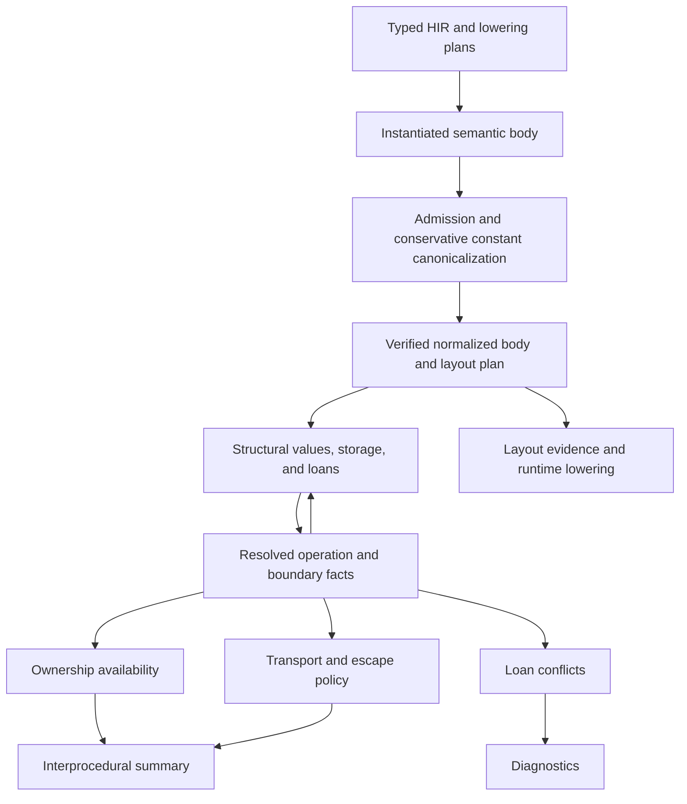

# Semantic ownership, capabilities, and boundaries

The compiler checks ownership and capability provenance over verified normalized
semantic IR. Runtime layout is a separate consumer of that boundary. A scalar-only
non-Copy value has ownership state even when its capability shape is empty.

## Admission and consumers



Admission distinguishes an upstream-blocked body from an internal normalization
failure. The shared types and diagnostic constructors live in
[`semantic/diagnostics.rs`](../../crates/hir/src/analysis/semantic/diagnostics.rs),
below the borrow checker. `SemanticDiagnostic` is also used by admission and layout
consumers; normalization does not depend on borrow-checker-owned error types.

Provisional queries supply facts needed to finish provider bindings and admission.
Final queries enforce the resulting ownership and boundary contracts. A blocked
query retains its blocking causes even if it has a conservative signature summary.
A successful summary with `may_return = false` describes divergence; neither a
blocked body nor an internal failure becomes a successful diverging body.

Admission-time CTFE runs before these summaries exist. Its conservative raw-body
invalidation remains independent. Contract-field definite assignment similarly
has a distinct initialization contract; it does not replace general ownership
availability for pointer referents.

## One operation contract

[`normalized/access.rs`](../../crates/hir/src/analysis/semantic/normalized/access.rs)
exhaustively describes statement accesses, terminator operands, and successor
arguments. It reuses `MemoryAccessKind`. Structural paths select the accessed
portion of an SSA value. Place accesses also require their carrier and index
operands, including when the operation is a store.

| Operation | Availability | Conflict access | Ownership transfer |
| --- | --- | --- | --- |
| Read | Selected contents are available | Shared | None |
| Move | Selected contents are available | Exclusive | Consume selected portion |
| MakeView | Source is available | Shared | None |
| Native borrow | Source is available | Shared, mutable, or reserved | None |
| Typed store | Source and destination address are usable; parent is available | Exclusive destination | Restore only a certified destination |
| Call | Arguments and callee entry requirements | Callee access history | Callee normal-return transformer |

Native capability carriers are not ownership-consuming copies. A projected move
selects its field rather than consuming the entire aggregate. A reserved mutable
receiver retains `BorrowActivation::AtCall`, so receiver reservation does not
prematurely conflict with nested argument evaluation.

Liveness, conflict checking, availability, and summary access collection consume
this contract. Each analysis applies its own transfer rule rather than inferring
semantics from a generic operand visitor.

Availability uses one evaluator for fixed-point propagation and diagnostic/summary
replay. Accesses explicitly identify address evaluation, operands, and writes;
their position in the flat vector is not an execution order. Carrier and index
reads see the incoming state. The consuming operand batch rejects overlapping
guarded ownership regions, including two uses of one SSA owner, before checking
callee entry requirements. Definite writes, normal-return effects, and the fresh
result holder are initialized afterward. Disjoint fields and mutually exclusive
guarded alternatives remain separate. Zero-sized non-Copy owners still cannot be
consumed twice, even though their physical accesses touch no bytes.

## Physical access footprints

[`capability/footprint.rs`](../../crates/hir/src/analysis/semantic/capability/footprint.rs)
combines a guarded region with a typed extent, a byte length, or an unknown extent.
Address identity, physical overlap, definite typed coverage, and valid native
contents are separate proofs. Different starting addresses do not imply disjoint
accesses, and full byte coverage does not establish native authority.

For linear memory, the semantic `size_of` representation contract supplies typed
widths and field/element offsets. Known nonwrapping intervals can prove separation;
unknown types, lengths, offsets, unsupported views, and overflowing arithmetic
retain possible overlap. Capability-leaf counts and runtime backing homes provide
no size evidence. Casts retain address identity while changing the accessed type,
including casts from zero-sized pointees. Other address spaces retain their object
semantics rather than using linear-memory byte arithmetic.

Intrinsic contracts distinguish byte and word operations and describe both sides
of copies, zeroing, hashing/logging, return/revert data, creation code, and external
call buffers. Zero-length byte accesses are empty; unknown lengths are not zero.
Byte writes remain may-writes and never certify typed initialization. Extents are
part of summary equality and survive scalar substitution, forwarding, and clobber
conditions. Corruption is discarded only after the full write footprint is proven
disjoint from the affected typed cell.

## Structural values and stable resolution

Capability values describe product fields, enum alternatives, and symbolic array
families. Their leaves distinguish raw addresses, views, native loans, and native
contents invalidated by byte writes. Regions combine typed storage roots,
structural projections, guards, and bound indices. An SSA holder is a logical
ownership location, not addressable storage.

The solver closes storage discovery and loan relations together. Resolving a call,
following a held capability, or resolving a boundary requirement can discover
another typed storage cell. Discovery triggers replay before snapshots and resolved
operations are published. Availability, conflict checks, and summary construction
then read those completed facts. Summary construction cannot extend storage.

Local identities come from normalized operations, values, and structural leaves.
Array and loop occurrences carry explicit indices or lexical witnesses. Export
renames occurrences to summary identities; call substitution maps them to the
call site. Replaying an analysis does not allocate a new opaque identity.

## Entry contents and opaque overwrites

Entry contents mean the caller's contents at function entry. Substituting an entry
source at a call can therefore resolve to a precise old pointer. They cannot model
bytes that an intervening write has replaced.

[`capability/opaque.rs`](../../crates/hir/src/analysis/semantic/capability/opaque.rs)
constructs arbitrary replacement contents from the affected shape. Raw pointer and
nominal handle leaves preserve their declared address-space contracts. Their opaque
addresses can alias existing compatible storage; they are not fresh allocations.
Array leaves have independent lexical witnesses rather than a shared invented
address for every element.

Raw bytes establish no native loan or view authority. Native leaves therefore
become explicit invalidity markers, carried through values, loads, summary export,
and call substitution. Definite corruption rejects typed use. A possible overwrite
through symbolic input aliases produces an explicit native-validity obligation:
the affected storage and write destination must be disjoint. Callers discharge
that obligation using their actual regions or forward it through symbolic inputs.
An unresolved concrete alias rejects. Only the preexisting valid alternatives can
supply native authority; arbitrary replacement bytes never create a loan.

An opaque alternative retains an overlap condition when its addresses are
representable. Call substitution removes it only after proving the affected cell
and write destination disjoint. This preserves fresh-allocation precision across
helpers while retaining corruption for possible aliases. A write through an earlier
arbitrary replacement retains that replacement's corruption prerequisite.
Dropping the additional overlap test widens uncertainty without growing nested
conditions or allowing repeated writes to invent unconditional corruption. A
definite typed store can replace invalid contents with valid native contents again.

Both generic memory invalidation and possibly overlapping typed stores use this
operation. Matching shapes do not prove matching byte alignment: a partial raw
store can corrupt a native slot while copying a valid native value.
An intrinsic byte write invalidates an exact tracked pointer cell too, even when
the intrinsic has no structural poststate. Weak writes retain the old possibility
as well as arbitrary replacement contents.

Abstract storage discovery follows inline fields. A type parameter behind a
pointer or native borrow belongs to separate referent storage and does not make
the containing representation abstract. Clobbering checks each capability leaf's
storage path, so writing a scalar field does not corrupt a disjoint pointer field.
Sealed EVM effect witnesses retain their trusted zero-sized representation and
do not acquire invented hidden fields.

## Definite writes

`RegionSet::definite_write` provides the shared certificate for strong provenance
updates and ownership restoration. The initial criterion requires one non-widened
destination with no additional existential target selection. A runtime index can
denote one cell, but coverage must still prove that this is the moved cell.

A may-target union such as `{A, B}` does not prove that either particular cell was
written. A field write does not restore an entire moved aggregate. At a call,
each guaranteed callee destination is instantiated separately and certified again:
an exact formal pointer may be an ambiguous actual pointer.

The certificate is necessary for a strong structural update, which also checks
interference among simultaneous poststates. Distinct poststate entries do not
encode an execution order.

## Summary composition

`BorrowSummary` contains several independent components:

- The result's structural capability value.
- Caller-visible capability-content poststates.
- Possible memory access history and its authorizers, for loan conflicts.
- Incoming ownership requirements and normal-return availability effects.
- Native-validity obligations for conditional raw overwrites.
- Boundary requirements for transport, retention, and writable storage.
- Whether a normal return is possible.

All components participate in equality and interning. Summary construction runs
the same availability analysis as local diagnostics; correctness does not depend
on a diagnostic query running first. Ownership effects are exported for scalar-only
non-Copy pointees as well as aggregates containing pointers or native borrows.

Signature-only summaries distinguish unknown results from unknown writable
contents. A returning native result includes valid referents and creates a result
loan when instantiated. Raw input candidates supply addresses without becoming
inherited native parents. An arbitrary memory referent also covers permitted fresh
allocation results; it does not claim the stronger identity of a known allocation.
Writable poststates separately join valid possible contents with shape-aware opaque
replacement, including invalidated-native alternatives. They cannot turn a raw
clobber into a guaranteed restoration of entry validity.

A bare callable signature does not bound raw effects to its arguments. Its fallback
includes arbitrary compatible-space reads, writes, and consumption, including for
parameterless calls. Each effect remains an individual `MemoryAccessKind` event;
choosing a maximum kind would lose either contents invalidation or ownership loss.
Compiler-defined intrinsic identities have explicit contracts instead. Numeric
intrinsics are recognized by their core-library identity, not by a user-declared
function's spelling. Unknown semantic addresses carry no runtime layout evidence.

Unresolved implementations produce explicit `Pending` validation, separate from
successful checking and upstream-blocked bodies. The pending result records the
unresolved semantic callee keys and propagates transitively through calls and
recursive query recovery. Conservative summary facts remain available internally
for analysis; they do not constitute a checked executable contract. Public borrow,
boundary, and summary consumers report pending validation as an incomplete result.

Generic templates retain type/normalized-IR checking, checks before an unresolved
call, and the call's operand checks. An unbounded unknown effect makes subsequent
memory-dependent checks conditional along every reachable successor. SSA holders
have no address, so their move checks remain active across statements and control
flow; moving through a borrowed/view carrier also remains forbidden. Concrete
specialization recomputes the body and its callees under the selected implementation
and must finish validation before runtime lowering. Executable calls that remain
opaque are rejected, even when they have no arguments or active borrows.

A trait default body is not an effect contract for an unresolved call: an
implementation may override it. Trusted intrinsic contracts remain usable through
trait dispatch. Compiler-provided contract code offsets and lengths have explicit
contracts only for concrete contract types, using the same library identity check
as runtime lowering.

Summary verification rejects a feasible returning native slot with no represented
referent. This is distinct from empty arrays, absent enum alternatives, moved
poststates, and genuinely nonreturning paths, which may contain no native value.
An empty enum result still requires provenance when every variant contains a
required native value, including through nested records and nonempty arrays.

The availability transformer is:

```text
unavailable_after =
    (unavailable_before minus certified definite reinitialization)
    union possibly unavailable on normal return
```

Incoming requirements include accesses that a preceding guaranteed initialization
has not discharged. Read, view, borrow, and move require available contents. A
write requires a usable parent and allows whole replacement of a moved slot.
Write requirements are conjunctive: a later whole write cannot excuse an earlier
partial write through a moved parent.

`move(p); initialize(p)` retains a move in conflict history while leaving `p`
available on return. `initialize(p); move(p)` can accept an unavailable `p` on
entry but leaves it unavailable on return. Sorting access history cannot reproduce
either ordered transfer.

Possible moves join by union. Definite initialization must hold on all feasible
normal-return paths. Disjoint representable guards preserve conditional facts;
overlapping paths require common coverage. The entry edge of a loop prevents its
body from being assumed to execute. Prior-iteration witnesses cannot establish a
definite write for the next iteration.

The must-initialization set contains caller-visible external storage whose type
can become moved or contain native validity obligations. Local moved facts still
receive every definite write. SSA definitions, fresh allocations, and
capability-free Copy storage do not accumulate in the summary set; byte writes
cannot reinitialize differently typed moved aggregates. This avoids constructing
unrelated offset-coverage conditions in wide encoders.

Recursive summaries start with no known normal return. Base cases establish
normal-return facts, and subsequent iterations compose them. Private opaque
addresses used only in availability effects are quantified within their clauses,
which avoids growing call-depth identities or accidentally relating independent
effects. Such private identities do not establish definite initialization in callers.
Opaque signature contracts conservatively consume exposed non-Copy raw pointees
and supply no restoration guarantee. Trusted byte-memory intrinsics describe byte
accesses; a byte write is not an ownership-consuming load.

Every call resolves its result sources, requirements, and effects against one
pre-call snapshot. Provenance poststates are then applied simultaneously. A callee
body still observes its own statement order. Aliasing between formal destinations
can make an additional forwarding summary less precise than inline execution;
sound overapproximation is required, universal acceptance equivalence is not.

## Related changes in this branch

Trait selection preserves implementation evidence and associated-constant
binders through selection and substitution. Those semantics support correct
instantiated bodies but are not part of the ownership dataflow or its abstract
domain.

Runtime changes consume the normalized body and its explicit layout plan, including
terminal capability stores through referents, materialized views, parameter
carriers, and synthetic values with independent runtime homes. Review
[`mir/runtime/lower/semantic_body.rs`](../../crates/mir/src/runtime/lower/semantic_body.rs),
the runtime return/argument adapters, and the codegen handle-preservation tests
separately from the static ownership transfer. Layout cannot supply ownership
facts missing from normalized semantics.

Frontend move marking recognizes dereferences of temporary pointers, including
selected fields and array elements. Lowering preserves those places through
normalization; projecting a read snapshot must not replace consuming the original
storage. Copy values remain non-consuming.

## Stored native references and static runtime views

Runtime lowering keeps ordinary compiler views in their static `Const`, `Object`,
or `Provider` representation. Local native borrows and specialized parameters can
also retain a known transport. Native `ref`/`mut` fields and raw-pointer slots use
`RefKind::Native`: a one-word handle to an immutable address/layout descriptor.
The descriptor distinguishes packed Fe memory, native Sonatina object memory,
and storage, transient, calldata, and code address spaces. Exporting an object
uses its original allocation, preserving aliases; converting a stored native
carrier back to a static view by copying its referent is forbidden.

Immutable constant views have no mutable allocation identity. Converting one to a
stored native reference realizes its scalar or aggregate value in addressable
storage; existing object references always export their original allocation.

Aggregate construction converts native fields explicitly with `RExpr::NativeRef`.
Joins of native references with different physical layouts use that same carrier,
and function declarations and body inference share the transport-join rule.
Loading a reference from a slot returns the stored carrier, not the slot address.
The verifier checks these conversions independently of semantic borrow checking;
runtime representation never supplies ownership or aliasing authority.

Copy reads of native call results bind the callee's declared reference carrier
before explicitly loading its referent. Slot assignment similarly uses the
destination's class to distinguish replacing a carrier from writing its referent.

Native scalar fields occupy words, and native enum payloads concatenate variants.
Raw memory, calldata and code use packed fields and overlaid enum payloads; storage
and transient storage use word slots and overlaid payloads. Descriptor projection
and dereference preserve these distinctions across calls and control flow. Creating
a descriptor costs a two-word heap allocation before optimization; copying an
existing native reference copies only its one-word handle. User buffers must reserve
their complete extent before writes, including across compiler-generated allocations.

## Verification and conservative limits

The semantic borrow suite pairs unsafe inline programs with helper and forwarding
forms. It covers implicit views, shared-loan moves, consumed scalar-only pointees,
opaque writes, typed restoration, ambiguous destinations, CFG joins, recursion,
and summary queries made before diagnostics. Bounded two- and three-cell models
compare joins, summary composition, and write guarantees with concrete executions.

Unknown raw addresses may alias moved local representation storage. Likewise,
simultaneous poststates and existential destinations can retain extra alternatives.
These cases can reject programs that a stronger relational analysis would accept.
They must never turn a possible write into definite initialization or grant native
authority to arbitrary bytes.

Use `cargo nextest r --release --no-fail-fast` for the complete suite, together with
`cargo +nightly fmt --all -- --check` and workspace Clippy. Admission, CTFE, layout,
runtime, and codegen tests are required as well as the focused borrow regressions.
